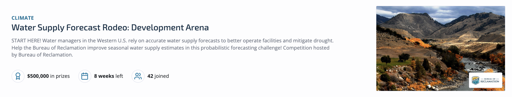
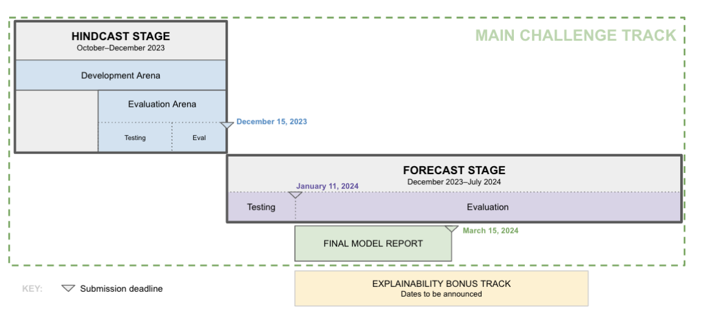
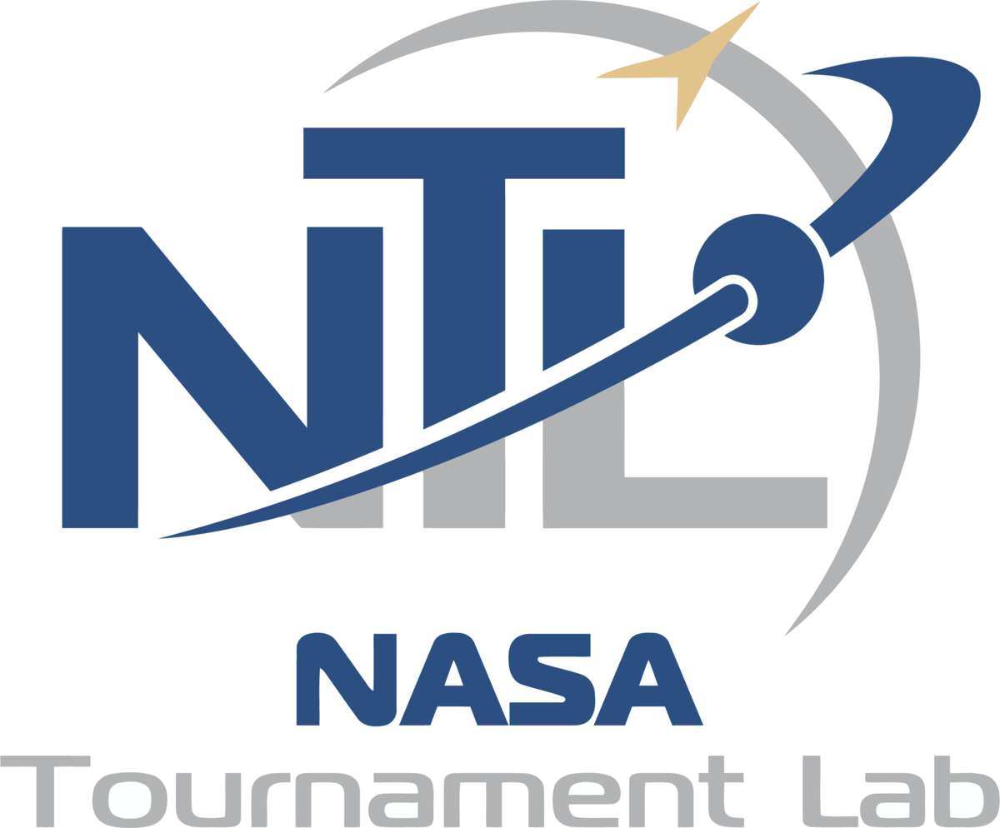

# Water Supply Forecast Rodeo: Development Arena

[Challenge Link](https://www.drivendata.org/competitions/254/reclamation-water-supply-forecast-dev/)

Accurate seasonal water supply forecasts are crucial for effective water resources management in the Western United States. This region faces dry conditions and high demand for water, and these forecasts are essential for making informed decisions. They guide everything from water supply management and flood control to hydropower generation and environmental objectives.

Yet, hydrological modeling is a complex task that depends on natural processes marked by inherent uncertainties, such as antecedent streamflow, snowpack accumulation, soil moisture dynamics, and rainfall patterns. To maximize the utility of these forecasts, it's essential to provide not just accurate predictions, but also comprehensive ranges of values that effectively convey the inherent uncertainties in the predictions.

The goal of this challenge is to develop probabilistic forecast models that predict naturalized cumulative streamflow volume at the 0.10, 0.50, and 0.90 quantiles. The challenge will occur over two stages: the Hindcast Stage will evaluate models on historical data simulating real-time forecasting, while the Forecast Stage will run in real-time during the 2024 season. Prizes will be awarded throughout the competition based on the accuracy of model predictions along with the judging of model reports explaining solutions by a panel of technical experts.

By improving the accuracy, explainability, and uncertainty characterization of seasonal streamflow forecasts, water resources managers will be better equiped to operate facilities for high flows, mitigate impacts of drought, improve hydropower generation, and meet environmental targets.

### Organisations

- Bureau of Reclamation (a provider of wholesale water and hydroelectric power in the U.S. that manages, develops, and protects water and related resources in an environmentally and economically sound manner)

- NASA (an independent agency of the U.S. federal government responsible for the civil space program, aeronautics research, and space research)

### Efficacy analysis of water supply forecasts for development
- [Article explaining importance of water security in global development](https://www.lse.ac.uk/granthaminstitute/explainers/what-is-water-security-and-how-is-it-impacted-by-climate-change/)
- Though this specific data is US-focused, the models and methods developed can be generalised to developing countries to improve water supply forecasting globally

### Team
- Jessica Rapson (lead, geospatial analysis)
- Yonatan Gideoni (model optimisation)
- Emil Ryd (climate data, feature engineering)
- Alexis Park (probalistic modeling)
