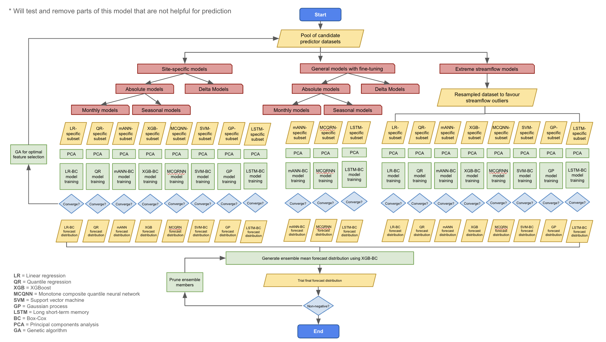

# Pipeline

Pipeline to run data cleaning files. File contain functions that can be executed to automate data cleaning. Order to execute is:

- cleaning.py
- feature_eng.py
- scaling.py
- clustering.py
- feature_select.py
- dim_reduct.py

The rough idea for how to build the ensemble model based on the M4 model structure is as follows:

